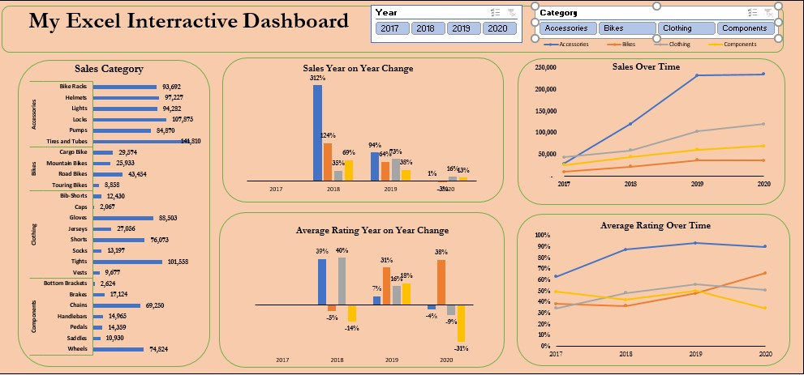
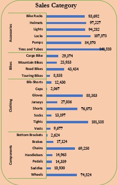
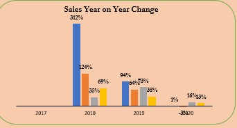
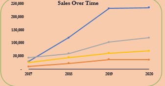
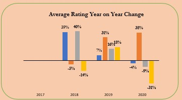
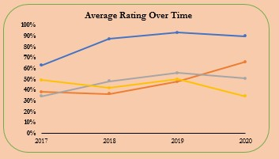

# BIKE-SALE-ANALYSIS

This Microsoft Excel dashboard shows the sales activity of a store that sells bicycles from 2017 through 2020. They concentrate on selling bike accessories, clothes, and bike parts.

**PROBLEM STATEMENT**
This analysis is aimed at checking:
1.	Sales activity over time
2.	Sales per year.
3.	Average rating over time.
4.	Sales made in each category. 

**DATA TRANSFORMATION**
The transformation was done using Microsoft Excel formulas and functions.

**SKILLS DEMONSTRATED**
1.	V-lookup
2.	Data consolidation
3.	Pivot table
4.	Pivot chart
5.	Average IF
6.	Count IF

## ANALYSIS AND VISUALIZATION
The visualization was done using Microsoft Excel, and insights were generated.

## INSIGHTS GENERATED
**1.	Sales category:** This displays the volume of each category's sales. A road bike is the most sold type of bicycle in this category, while a touring bike is the least sold. Tights were the most sold and hats the least sold item in the clothes category. Wheels are the most sold component, while bottom brackets are the least sold. The bar chart was used to determine that hats were the least popular item in the clothing category and that tires and tubes were the most popular products in the accessory category.

**2.	Sales year on year:** This chart shows that the highest overall sales were made in 2018 from the accessory category compared to other years and other product categories.

**3.	Sales over Time:** This chart shows a significant increase in sales between 2017 and 2019, which remained relatively constant between 2019 and 2020.

**4.	Average rating year on year:** This demonstrates that, in contrast to clothing and accessories, motorcycles and components had lower ratings in 2018. Bicycle sales had the highest rating in 2019 while accessories received the lowest rating. In 2020, the category of bikes received the highest ratings, while other categories received low ratings.

**5.	Average rating over time:** The most often purchased item, accessories, also had the highest ratings over time, with an overall rating of more than 60% between 2017 and 2020 compared to other categories that received average ratings.

## CONCLUSION

Based on the analysis, it can be concluded that the accessory category is the most popular, with total sales of $477,978. Clothing is the second most popular category, with total sales of $330,561, followed by bike components ($204,076) and bikes ($107,819).
